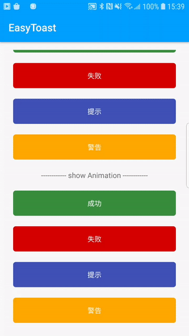
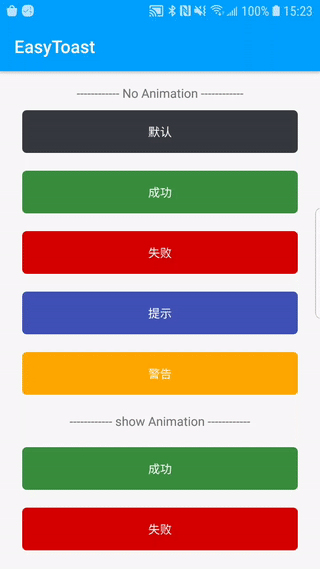

# EasyToast

一款Kotlin简单使用的Toast(带图标动画)

## 演示
|显示图标动画|不显示动画|
|:---:|:---:|
|||


添加如下配置将EasyToast引入到你的项目当中：
```groovv
dependencies {
    implementation 'com.toast.wm:easytoast:1.0.0'
}
```
然后就可以简单使用弹出Toast了（默认都是显示图标动画，如果不显示，请在方法里填false）：
```kotlin
Int(@StringRes) or String.showSuccessToast() //成功
                         .toast_error.showErrorToast() //失败
                         .toast_info.showInfoToast() //提示
                         .showWarningToast() //警告
                         .showToast()   //默认

例如：R.string.toast.showToast() or "默认".showToast()
```
## 修改默认效果
在任何地方调用：
```kotlin
EasyToast.Config.getInstance().apply {
                setErrorColor(@ColorInt int errorColor) // optional
                setInfoColor(@ColorInt int infoColor) // optional
                setSuccessColor(@ColorInt int successColor) // optional
                setWarningColor(@ColorInt int warningColor) // optional
                setTextColor(@ColorInt int textColor) // optional
                tintIcon(boolean tintIcon) // 是否显示图标
                setUseAnim(boolean useAnim) //是否显示动画
                setToastTypeface(@NonNull Typeface typeface) // optional
                setTextSize(int sizeInSp) // optional
        }.apply()
```

## License
```
Copyright (C)  wangmeng, EasyToast Open Source Project

Licensed under the Apache License, Version 2.0 (the "License");
you may not use this file except in compliance with the License.
You may obtain a copy of the License at

     http://www.apache.org/licenses/LICENSE-2.0

Unless required by applicable law or agreed to in writing, software
distributed under the License is distributed on an "AS IS" BASIS,
WITHOUT WARRANTIES OR CONDITIONS OF ANY KIND, either express or implied.
See the License for the specific language governing permissions and
limitations under the License.
```


